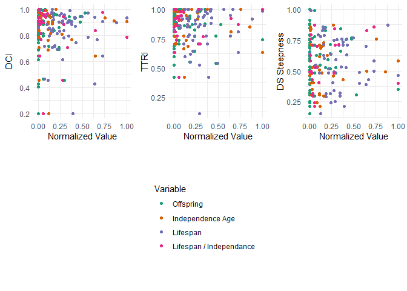

``` r
library(dplyr)
#> 
#> Attaching package: 'dplyr'
#> The following objects are masked from 'package:stats':
#> 
#>     filter, lag
#> The following objects are masked from 'package:base':
#> 
#>     intersect, setdiff, setequal, union
library(ggplot2)
library(RColorBrewer)
library(cowplot)
library(gridGraphics)
#> Loading required package: grid


library(DomArchive)
data(dom.data)
data(dom.metadata)
```

Helpers for dom:

``` r
# Function to standardize the strings
standardize_string <- function(x) {
  tolower(gsub("_", " ", x))
}

# Standardize both vectors
dom.species <- standardize_string(dom.metadata$species)
dom.metadata$species <- dom.species
```

Offspring:

``` r
offspring.df <- read.csv("databases/offspring.csv")

# find common species in dom and offspring
offspring.species.com <- offspring.df$species[offspring.df$species %in% dom.species]

# get average values of domination for species, in common species between dom and offspring
dom_offspring.avg <- dom.metadata %>%
  filter(dom.species %in% offspring.species.com) %>%
  group_by(species) %>%
  summarize(
    dci.avg = mean(dci, na.rm = TRUE),
    ttri.avg = mean(ttri, na.rm = TRUE),
    ds_steepness.avg = mean(ds_steepness, na.rm = TRUE),
    modified_landaus_h.avg = mean(modified_landaus_h, na.rm = TRUE)
  ) %>%
  left_join(offspring.df %>% select(species, offspring),by = "species")

# add normalize values
dom_offspring.avg$offspring.norm <- (dom_offspring.avg$offspring - min(dom_offspring.avg$offspring)) / (max(dom_offspring.avg$offspring) - min(dom_offspring.avg$offspring))

# run regressions
summary(lm(dci.avg ~ offspring, data = dom_offspring.avg))
#> 
#> Call:
#> lm(formula = dci.avg ~ offspring, data = dom_offspring.avg)
#> 
#> Residuals:
#>      Min       1Q   Median       3Q      Max 
#> -0.63152 -0.04040  0.05158  0.10661  0.16740 
#> 
#> Coefficients:
#>             Estimate Std. Error t value Pr(>|t|)    
#> (Intercept) 0.824997   0.025814  31.959   <2e-16 ***
#> offspring   0.006348   0.006500   0.977    0.332    
#> ---
#> Signif. codes:  0 '***' 0.001 '**' 0.01 '*' 0.05 '.' 0.1 ' ' 1
#> 
#> Residual standard error: 0.1597 on 67 degrees of freedom
#> Multiple R-squared:  0.01403,    Adjusted R-squared:  -0.0006815 
#> F-statistic: 0.9537 on 1 and 67 DF,  p-value: 0.3323
summary(lm(ttri.avg ~ offspring, data = dom_offspring.avg))
#> 
#> Call:
#> lm(formula = ttri.avg ~ offspring, data = dom_offspring.avg)
#> 
#> Residuals:
#>      Min       1Q   Median       3Q      Max 
#> -0.46068 -0.03273  0.03618  0.10475  0.18739 
#> 
#> Coefficients:
#>              Estimate Std. Error t value Pr(>|t|)    
#> (Intercept)  0.892774   0.022727  39.283   <2e-16 ***
#> offspring   -0.010020   0.005723  -1.751   0.0845 .  
#> ---
#> Signif. codes:  0 '***' 0.001 '**' 0.01 '*' 0.05 '.' 0.1 ' ' 1
#> 
#> Residual standard error: 0.1406 on 67 degrees of freedom
#> Multiple R-squared:  0.04375,    Adjusted R-squared:  0.02948 
#> F-statistic: 3.066 on 1 and 67 DF,  p-value: 0.08454
summary(lm(ds_steepness.avg ~ offspring, data = dom_offspring.avg))
#> 
#> Call:
#> lm(formula = ds_steepness.avg ~ offspring, data = dom_offspring.avg)
#> 
#> Residuals:
#>      Min       1Q   Median       3Q      Max 
#> -0.43678 -0.13130  0.02354  0.15827  0.40804 
#> 
#> Coefficients:
#>              Estimate Std. Error t value Pr(>|t|)    
#> (Intercept)  0.591943   0.032985  17.946   <2e-16 ***
#> offspring   -0.001635   0.008306  -0.197    0.844    
#> ---
#> Signif. codes:  0 '***' 0.001 '**' 0.01 '*' 0.05 '.' 0.1 ' ' 1
#> 
#> Residual standard error: 0.204 on 67 degrees of freedom
#> Multiple R-squared:  0.0005784,  Adjusted R-squared:  -0.01434 
#> F-statistic: 0.03877 on 1 and 67 DF,  p-value: 0.8445
summary(lm(modified_landaus_h.avg ~ offspring, data = dom_offspring.avg))
#> 
#> Call:
#> lm(formula = modified_landaus_h.avg ~ offspring, data = dom_offspring.avg)
#> 
#> Residuals:
#>      Min       1Q   Median       3Q      Max 
#> -0.50113 -0.09759  0.01246  0.11354  0.32783 
#> 
#> Coefficients:
#>              Estimate Std. Error t value Pr(>|t|)    
#> (Intercept)  0.678867   0.031031  21.877   <2e-16 ***
#> offspring   -0.003347   0.007814  -0.428     0.67    
#> ---
#> Signif. codes:  0 '***' 0.001 '**' 0.01 '*' 0.05 '.' 0.1 ' ' 1
#> 
#> Residual standard error: 0.1919 on 67 degrees of freedom
#> Multiple R-squared:  0.00273,    Adjusted R-squared:  -0.01215 
#> F-statistic: 0.1834 on 1 and 67 DF,  p-value: 0.6698
```

Independence age:

``` r
ind.df <- read.csv("databases/ind.csv")

# find common species in dom and ind
ind.species.com <- ind.df$species[ind.df$species %in% dom.species]

# get average values of domination for species, in common species between dom and ind
dom_ind.avg <- dom.metadata %>%
  filter(dom.species %in% ind.species.com) %>%
  group_by(species) %>%
  summarize(
    dci.avg = mean(dci, na.rm = TRUE),
    ttri.avg = mean(ttri, na.rm = TRUE),
    ds_steepness.avg = mean(ds_steepness, na.rm = TRUE),
    modified_landaus_h.avg = mean(modified_landaus_h, na.rm = TRUE)
  ) %>%
  left_join(ind.df %>% select(species, ind),by = "species")

# add normalized values
dom_ind.avg$ind.norm <- (dom_ind.avg$ind - min(dom_ind.avg$ind)) / (max(dom_ind.avg$ind) - min(dom_ind.avg$ind))

# run regressions
summary(lm(dci.avg ~ ind, data = dom_ind.avg))
#> 
#> Call:
#> lm(formula = dci.avg ~ ind, data = dom_ind.avg)
#> 
#> Residuals:
#>      Min       1Q   Median       3Q      Max 
#> -0.65238 -0.03860  0.04726  0.09000  0.14706 
#> 
#> Coefficients:
#>              Estimate Std. Error t value Pr(>|t|)    
#> (Intercept) 8.512e-01  3.312e-02  25.703   <2e-16 ***
#> ind         1.761e-09  2.276e-08   0.077    0.939    
#> ---
#> Signif. codes:  0 '***' 0.001 '**' 0.01 '*' 0.05 '.' 0.1 ' ' 1
#> 
#> Residual standard error: 0.1607 on 34 degrees of freedom
#> Multiple R-squared:  0.0001761,  Adjusted R-squared:  -0.02923 
#> F-statistic: 0.00599 on 1 and 34 DF,  p-value: 0.9388
summary(lm(ttri.avg ~ ind, data = dom_ind.avg))
#> 
#> Call:
#> lm(formula = ttri.avg ~ ind, data = dom_ind.avg)
#> 
#> Residuals:
#>      Min       1Q   Median       3Q      Max 
#> -0.44815 -0.11112  0.04758  0.11034  0.15937 
#> 
#> Coefficients:
#>               Estimate Std. Error t value Pr(>|t|)    
#> (Intercept)  8.757e-01  2.916e-02  30.028   <2e-16 ***
#> ind         -9.652e-09  2.004e-08  -0.482    0.633    
#> ---
#> Signif. codes:  0 '***' 0.001 '**' 0.01 '*' 0.05 '.' 0.1 ' ' 1
#> 
#> Residual standard error: 0.1415 on 34 degrees of freedom
#> Multiple R-squared:  0.006779,   Adjusted R-squared:  -0.02243 
#> F-statistic: 0.232 on 1 and 34 DF,  p-value: 0.6331
summary(lm(ds_steepness.avg ~ ind, data = dom_ind.avg))
#> 
#> Call:
#> lm(formula = ds_steepness.avg ~ ind, data = dom_ind.avg)
#> 
#> Residuals:
#>      Min       1Q   Median       3Q      Max 
#> -0.33994 -0.13619 -0.03243  0.15754  0.31537 
#> 
#> Coefficients:
#>              Estimate Std. Error t value Pr(>|t|)    
#> (Intercept) 5.473e-01  3.926e-02  13.941 1.27e-15 ***
#> ind         7.259e-09  2.697e-08   0.269    0.789    
#> ---
#> Signif. codes:  0 '***' 0.001 '**' 0.01 '*' 0.05 '.' 0.1 ' ' 1
#> 
#> Residual standard error: 0.1905 on 34 degrees of freedom
#> Multiple R-squared:  0.002126,   Adjusted R-squared:  -0.02722 
#> F-statistic: 0.07243 on 1 and 34 DF,  p-value: 0.7895
summary(lm(modified_landaus_h.avg ~ ind, data = dom_ind.avg))
#> 
#> Call:
#> lm(formula = modified_landaus_h.avg ~ ind, data = dom_ind.avg)
#> 
#> Residuals:
#>      Min       1Q   Median       3Q      Max 
#> -0.37071 -0.10186  0.01803  0.09653  0.33111 
#> 
#> Coefficients:
#>              Estimate Std. Error t value Pr(>|t|)    
#> (Intercept) 6.256e-01  3.531e-02   17.72   <2e-16 ***
#> ind         1.942e-08  2.426e-08    0.80    0.429    
#> ---
#> Signif. codes:  0 '***' 0.001 '**' 0.01 '*' 0.05 '.' 0.1 ' ' 1
#> 
#> Residual standard error: 0.1714 on 34 degrees of freedom
#> Multiple R-squared:  0.01849,    Adjusted R-squared:  -0.01038 
#> F-statistic: 0.6405 on 1 and 34 DF,  p-value: 0.4291
```

Lifespan in the wild:

``` r
lifespan.df <- read.csv("databases/lifespan.csv")

# find common species in dom and lifespan
lifespan.species.com <- lifespan.df$species[lifespan.df$species %in% dom.species]

# get average values of domination for species, in common species between dom and lifespan
dom_lifespan.avg <- dom.metadata %>%
  filter(dom.species %in% lifespan.species.com) %>%
  group_by(species) %>%
  summarize(
    dci.avg = mean(dci, na.rm = TRUE),
    ttri.avg = mean(ttri, na.rm = TRUE),
    ds_steepness.avg = mean(ds_steepness, na.rm = TRUE),
    modified_landaus_h.avg = mean(modified_landaus_h, na.rm = TRUE)
  ) %>%
  left_join(lifespan.df %>% select(species, lifespan),by = "species")

# add normalized values
dom_lifespan.avg$lifespan.norm <- (dom_lifespan.avg$lifespan - min(dom_lifespan.avg$lifespan)) / (max(dom_lifespan.avg$lifespan) - min(dom_lifespan.avg$lifespan))

# run regressions
summary(lm(dci.avg ~ lifespan, data = dom_lifespan.avg))
#> 
#> Call:
#> lm(formula = dci.avg ~ lifespan, data = dom_lifespan.avg)
#> 
#> Residuals:
#>      Min       1Q   Median       3Q      Max 
#> -0.63639 -0.04629  0.05588  0.10813  0.15992 
#> 
#> Coefficients:
#>               Estimate Std. Error t value Pr(>|t|)    
#> (Intercept)  0.8429688  0.0385855  21.847   <2e-16 ***
#> lifespan    -0.0002411  0.0014407  -0.167    0.868    
#> ---
#> Signif. codes:  0 '***' 0.001 '**' 0.01 '*' 0.05 '.' 0.1 ' ' 1
#> 
#> Residual standard error: 0.1599 on 55 degrees of freedom
#> Multiple R-squared:  0.0005089,  Adjusted R-squared:  -0.01766 
#> F-statistic: 0.02801 on 1 and 55 DF,  p-value: 0.8677
summary(lm(ttri.avg ~ lifespan, data = dom_lifespan.avg))
#> 
#> Call:
#> lm(formula = ttri.avg ~ lifespan, data = dom_lifespan.avg)
#> 
#> Residuals:
#>      Min       1Q   Median       3Q      Max 
#> -0.73030 -0.06602  0.04290  0.12072  0.17051 
#> 
#> Coefficients:
#>              Estimate Std. Error t value Pr(>|t|)    
#> (Intercept) 0.8282311  0.0425832  19.450   <2e-16 ***
#> lifespan    0.0006276  0.0015899   0.395    0.695    
#> ---
#> Signif. codes:  0 '***' 0.001 '**' 0.01 '*' 0.05 '.' 0.1 ' ' 1
#> 
#> Residual standard error: 0.1765 on 55 degrees of freedom
#> Multiple R-squared:  0.002825,   Adjusted R-squared:  -0.01531 
#> F-statistic: 0.1558 on 1 and 55 DF,  p-value: 0.6946
summary(lm(ds_steepness.avg ~ lifespan, data = dom_lifespan.avg))
#> 
#> Call:
#> lm(formula = ds_steepness.avg ~ lifespan, data = dom_lifespan.avg)
#> 
#> Residuals:
#>      Min       1Q   Median       3Q      Max 
#> -0.43944 -0.11960  0.01025  0.17601  0.38611 
#> 
#> Coefficients:
#>              Estimate Std. Error t value Pr(>|t|)    
#> (Intercept)  0.605313   0.049428  12.246   <2e-16 ***
#> lifespan    -0.001234   0.001845  -0.669    0.506    
#> ---
#> Signif. codes:  0 '***' 0.001 '**' 0.01 '*' 0.05 '.' 0.1 ' ' 1
#> 
#> Residual standard error: 0.2049 on 55 degrees of freedom
#> Multiple R-squared:  0.008064,   Adjusted R-squared:  -0.009971 
#> F-statistic: 0.4472 on 1 and 55 DF,  p-value: 0.5065
summary(lm(modified_landaus_h.avg ~ lifespan, data = dom_lifespan.avg))
#> 
#> Call:
#> lm(formula = modified_landaus_h.avg ~ lifespan, data = dom_lifespan.avg)
#> 
#> Residuals:
#>      Min       1Q   Median       3Q      Max 
#> -0.49589 -0.08170  0.03014  0.16289  0.32688 
#> 
#> Coefficients:
#>               Estimate Std. Error t value Pr(>|t|)    
#> (Intercept)  0.6738302  0.0481516  13.994   <2e-16 ***
#> lifespan    -0.0003552  0.0017978  -0.198    0.844    
#> ---
#> Signif. codes:  0 '***' 0.001 '**' 0.01 '*' 0.05 '.' 0.1 ' ' 1
#> 
#> Residual standard error: 0.1996 on 55 degrees of freedom
#> Multiple R-squared:  0.0007091,  Adjusted R-squared:  -0.01746 
#> F-statistic: 0.03903 on 1 and 55 DF,  p-value: 0.8441
```

Crosses:

``` r
# offspring and ind
dom_offspring_ind.avg <- merge(dom_offspring.avg, dom_ind.avg, by = c("species", "dci.avg", "ttri.avg", "ds_steepness.avg", "modified_landaus_h.avg"))

summary(lm(dci.avg ~ offspring + ind, data = dom_offspring_ind.avg))
#> 
#> Call:
#> lm(formula = dci.avg ~ offspring + ind, data = dom_offspring_ind.avg)
#> 
#> Residuals:
#>      Min       1Q   Median       3Q      Max 
#> -0.63929 -0.03009  0.04783  0.09992  0.15428 
#> 
#> Coefficients:
#>              Estimate Std. Error t value Pr(>|t|)    
#> (Intercept) 8.306e-01  4.854e-02  17.112   <2e-16 ***
#> offspring   4.101e-03  9.078e-03   0.452    0.655    
#> ind         7.832e-09  2.565e-08   0.305    0.762    
#> ---
#> Signif. codes:  0 '***' 0.001 '**' 0.01 '*' 0.05 '.' 0.1 ' ' 1
#> 
#> Residual standard error: 0.1705 on 29 degrees of freedom
#> Multiple R-squared:  0.00809,    Adjusted R-squared:  -0.06032 
#> F-statistic: 0.1183 on 2 and 29 DF,  p-value: 0.8889
summary(lm(ttri.avg ~ offspring + ind, data = dom_offspring_ind.avg))
#> 
#> Call:
#> lm(formula = ttri.avg ~ offspring + ind, data = dom_offspring_ind.avg)
#> 
#> Residuals:
#>      Min       1Q   Median       3Q      Max 
#> -0.46121 -0.09756  0.04688  0.09665  0.16905 
#> 
#> Coefficients:
#>               Estimate Std. Error t value Pr(>|t|)    
#> (Intercept)  8.999e-01  4.148e-02  21.697   <2e-16 ***
#> offspring   -7.067e-03  7.757e-03  -0.911    0.370    
#> ind         -1.707e-08  2.192e-08  -0.779    0.443    
#> ---
#> Signif. codes:  0 '***' 0.001 '**' 0.01 '*' 0.05 '.' 0.1 ' ' 1
#> 
#> Residual standard error: 0.1457 on 29 degrees of freedom
#> Multiple R-squared:  0.03701,    Adjusted R-squared:  -0.0294 
#> F-statistic: 0.5573 on 2 and 29 DF,  p-value: 0.5788
summary(lm(ds_steepness.avg ~ offspring + ind, data = dom_offspring_ind.avg))
#> 
#> Call:
#> lm(formula = ds_steepness.avg ~ offspring + ind, data = dom_offspring_ind.avg)
#> 
#> Residuals:
#>      Min       1Q   Median       3Q      Max 
#> -0.32892 -0.12700 -0.03072  0.16259  0.33614 
#> 
#> Coefficients:
#>               Estimate Std. Error t value Pr(>|t|)    
#> (Intercept)  5.393e-01  5.455e-02   9.886 8.56e-11 ***
#> offspring   -4.514e-03  1.020e-02  -0.442    0.661    
#> ind          9.883e-09  2.883e-08   0.343    0.734    
#> ---
#> Signif. codes:  0 '***' 0.001 '**' 0.01 '*' 0.05 '.' 0.1 ' ' 1
#> 
#> Residual standard error: 0.1916 on 29 degrees of freedom
#> Multiple R-squared:  0.01498,    Adjusted R-squared:  -0.05295 
#> F-statistic: 0.2206 on 2 and 29 DF,  p-value: 0.8034
summary(lm(modified_landaus_h.avg ~ offspring + ind, data = dom_offspring_ind.avg))
#> 
#> Call:
#> lm(formula = modified_landaus_h.avg ~ offspring + ind, data = dom_offspring_ind.avg)
#> 
#> Residuals:
#>      Min       1Q   Median       3Q      Max 
#> -0.35905 -0.11713  0.01470  0.09164  0.35175 
#> 
#> Coefficients:
#>               Estimate Std. Error t value Pr(>|t|)    
#> (Intercept)  6.157e-01  4.978e-02  12.367 4.34e-13 ***
#> offspring   -2.684e-03  9.310e-03  -0.288    0.775    
#> ind          2.196e-08  2.631e-08   0.835    0.411    
#> ---
#> Signif. codes:  0 '***' 0.001 '**' 0.01 '*' 0.05 '.' 0.1 ' ' 1
#> 
#> Residual standard error: 0.1749 on 29 degrees of freedom
#> Multiple R-squared:  0.03365,    Adjusted R-squared:  -0.033 
#> F-statistic: 0.5049 on 2 and 29 DF,  p-value: 0.6088

# offspring and lifespan
dom_offspring_lifespan.avg <- merge(dom_offspring.avg, dom_lifespan.avg, by = c("species", "dci.avg", "ttri.avg", "ds_steepness.avg", "modified_landaus_h.avg"))

summary(lm(dci.avg ~ offspring + lifespan, data = dom_offspring_lifespan.avg))
#> 
#> Call:
#> lm(formula = dci.avg ~ offspring + lifespan, data = dom_offspring_lifespan.avg)
#> 
#> Residuals:
#>      Min       1Q   Median       3Q      Max 
#> -0.61967 -0.04169  0.05602  0.09765  0.17564 
#> 
#> Coefficients:
#>             Estimate Std. Error t value Pr(>|t|)    
#> (Intercept) 0.800611   0.056514  14.167   <2e-16 ***
#> offspring   0.008364   0.009903   0.845    0.402    
#> lifespan    0.000376   0.001596   0.236    0.815    
#> ---
#> Signif. codes:  0 '***' 0.001 '**' 0.01 '*' 0.05 '.' 0.1 ' ' 1
#> 
#> Residual standard error: 0.1663 on 49 degrees of freedom
#> Multiple R-squared:  0.01436,    Adjusted R-squared:  -0.02587 
#> F-statistic: 0.357 on 2 and 49 DF,  p-value: 0.7016
summary(lm(ttri.avg ~ offspring + lifespan, data = dom_offspring_lifespan.avg))
#> 
#> Call:
#> lm(formula = ttri.avg ~ offspring + lifespan, data = dom_offspring_lifespan.avg)
#> 
#> Residuals:
#>      Min       1Q   Median       3Q      Max 
#> -0.44697 -0.06995  0.03925  0.11160  0.19859 
#> 
#> Coefficients:
#>               Estimate Std. Error t value Pr(>|t|)    
#> (Intercept)  0.8740634  0.0511536  17.087   <2e-16 ***
#> offspring   -0.0095307  0.0089639  -1.063    0.293    
#> lifespan     0.0001613  0.0014444   0.112    0.912    
#> ---
#> Signif. codes:  0 '***' 0.001 '**' 0.01 '*' 0.05 '.' 0.1 ' ' 1
#> 
#> Residual standard error: 0.1505 on 49 degrees of freedom
#> Multiple R-squared:  0.02671,    Adjusted R-squared:  -0.01302 
#> F-statistic: 0.6723 on 2 and 49 DF,  p-value: 0.5152
summary(lm(ds_steepness.avg ~ offspring + lifespan, data = dom_offspring_lifespan.avg))
#> 
#> Call:
#> lm(formula = ds_steepness.avg ~ offspring + lifespan, data = dom_offspring_lifespan.avg)
#> 
#> Residuals:
#>      Min       1Q   Median       3Q      Max 
#> -0.39049 -0.14188 -0.01315  0.16095  0.43027 
#> 
#> Coefficients:
#>               Estimate Std. Error t value Pr(>|t|)    
#> (Intercept)  0.5313795  0.0700943   7.581  8.4e-10 ***
#> offspring    0.0137662  0.0122830   1.121    0.268    
#> lifespan    -0.0001119  0.0019792  -0.057    0.955    
#> ---
#> Signif. codes:  0 '***' 0.001 '**' 0.01 '*' 0.05 '.' 0.1 ' ' 1
#> 
#> Residual standard error: 0.2063 on 49 degrees of freedom
#> Multiple R-squared:  0.02846,    Adjusted R-squared:  -0.01119 
#> F-statistic: 0.7177 on 2 and 49 DF,  p-value: 0.4929
summary(lm(modified_landaus_h.avg ~ offspring + lifespan, data = dom_offspring_lifespan.avg))
#> 
#> Call:
#> lm(formula = modified_landaus_h.avg ~ offspring + lifespan, data = dom_offspring_lifespan.avg)
#> 
#> Residuals:
#>      Min       1Q   Median       3Q      Max 
#> -0.46701 -0.08176  0.01799  0.14665  0.35161 
#> 
#> Coefficients:
#>             Estimate Std. Error t value Pr(>|t|)    
#> (Intercept) 0.628951   0.069491   9.051 4.95e-12 ***
#> offspring   0.009418   0.012177   0.773    0.443    
#> lifespan    0.000303   0.001962   0.154    0.878    
#> ---
#> Signif. codes:  0 '***' 0.001 '**' 0.01 '*' 0.05 '.' 0.1 ' ' 1
#> 
#> Residual standard error: 0.2045 on 49 degrees of freedom
#> Multiple R-squared:  0.01222,    Adjusted R-squared:  -0.0281 
#> F-statistic: 0.303 on 2 and 49 DF,  p-value: 0.74

# ind and lifespan
dom_ind_lifespan.avg <- merge(dom_ind.avg, dom_lifespan.avg, by = c("species", "dci.avg", "ttri.avg", "ds_steepness.avg", "modified_landaus_h.avg"))

summary(lm(dci.avg ~ ind + lifespan, data = dom_ind_lifespan.avg))
#> 
#> Call:
#> lm(formula = dci.avg ~ ind + lifespan, data = dom_ind_lifespan.avg)
#> 
#> Residuals:
#>      Min       1Q   Median       3Q      Max 
#> -0.64827 -0.02884  0.04773  0.10193  0.14379 
#> 
#> Coefficients:
#>               Estimate Std. Error t value Pr(>|t|)    
#> (Intercept)  8.635e-01  6.367e-02  13.562 9.54e-13 ***
#> ind          6.819e-09  2.878e-08   0.237    0.815    
#> lifespan    -6.862e-04  2.180e-03  -0.315    0.756    
#> ---
#> Signif. codes:  0 '***' 0.001 '**' 0.01 '*' 0.05 '.' 0.1 ' ' 1
#> 
#> Residual standard error: 0.1842 on 24 degrees of freedom
#> Multiple R-squared:  0.004781,   Adjusted R-squared:  -0.07815 
#> F-statistic: 0.05765 on 2 and 24 DF,  p-value: 0.9441
summary(lm(ttri.avg ~ ind + lifespan, data = dom_ind_lifespan.avg))
#> 
#> Call:
#> lm(formula = ttri.avg ~ ind + lifespan, data = dom_ind_lifespan.avg)
#> 
#> Residuals:
#>      Min       1Q   Median       3Q      Max 
#> -0.45631 -0.06901  0.04649  0.09013  0.17687 
#> 
#> Coefficients:
#>               Estimate Std. Error t value Pr(>|t|)    
#> (Intercept)  8.619e-01  4.892e-02  17.620 3.11e-15 ***
#> ind         -1.864e-08  2.211e-08  -0.843    0.407    
#> lifespan     9.633e-04  1.675e-03   0.575    0.571    
#> ---
#> Signif. codes:  0 '***' 0.001 '**' 0.01 '*' 0.05 '.' 0.1 ' ' 1
#> 
#> Residual standard error: 0.1415 on 24 degrees of freedom
#> Multiple R-squared:  0.03178,    Adjusted R-squared:  -0.04891 
#> F-statistic: 0.3939 on 2 and 24 DF,  p-value: 0.6787
summary(lm(ds_steepness.avg ~ ind + lifespan, data = dom_ind_lifespan.avg))
#> 
#> Call:
#> lm(formula = ds_steepness.avg ~ ind + lifespan, data = dom_ind_lifespan.avg)
#> 
#> Residuals:
#>      Min       1Q   Median       3Q      Max 
#> -0.34460 -0.13990 -0.03119  0.15561  0.32142 
#> 
#> Coefficients:
#>               Estimate Std. Error t value Pr(>|t|)    
#> (Intercept)  5.607e-01  7.186e-02   7.803 4.89e-08 ***
#> ind          5.672e-09  3.248e-08   0.175    0.863    
#> lifespan    -2.808e-04  2.460e-03  -0.114    0.910    
#> ---
#> Signif. codes:  0 '***' 0.001 '**' 0.01 '*' 0.05 '.' 0.1 ' ' 1
#> 
#> Residual standard error: 0.2079 on 24 degrees of freedom
#> Multiple R-squared:  0.001381,   Adjusted R-squared:  -0.08184 
#> F-statistic: 0.01659 on 2 and 24 DF,  p-value: 0.9836
summary(lm(modified_landaus_h.avg ~ ind + lifespan, data = dom_ind_lifespan.avg))
#> 
#> Call:
#> lm(formula = modified_landaus_h.avg ~ ind + lifespan, data = dom_ind_lifespan.avg)
#> 
#> Residuals:
#>      Min       1Q   Median       3Q      Max 
#> -0.37919 -0.10887  0.01112  0.11573  0.31936 
#> 
#> Coefficients:
#>               Estimate Std. Error t value Pr(>|t|)    
#> (Intercept)  6.420e-01  6.638e-02   9.671 9.41e-10 ***
#> ind          1.833e-08  3.001e-08   0.611    0.547    
#> lifespan    -4.147e-04  2.273e-03  -0.182    0.857    
#> ---
#> Signif. codes:  0 '***' 0.001 '**' 0.01 '*' 0.05 '.' 0.1 ' ' 1
#> 
#> Residual standard error: 0.1921 on 24 degrees of freedom
#> Multiple R-squared:  0.01542,    Adjusted R-squared:  -0.06663 
#> F-statistic: 0.1879 on 2 and 24 DF,  p-value: 0.8299

# all
dom_offspring_ind_lifespan.avg <- merge(dom_offspring.avg, dom_ind_lifespan.avg, by = c("species", "dci.avg", "ttri.avg", "ds_steepness.avg", "modified_landaus_h.avg"))

summary(lm(dci.avg ~ offspring + ind + lifespan, data = dom_offspring_ind_lifespan.avg))
#> 
#> Call:
#> lm(formula = dci.avg ~ offspring + ind + lifespan, data = dom_offspring_ind_lifespan.avg)
#> 
#> Residuals:
#>      Min       1Q   Median       3Q      Max 
#> -0.64304 -0.03424  0.05367  0.10818  0.14941 
#> 
#> Coefficients:
#>               Estimate Std. Error t value Pr(>|t|)    
#> (Intercept)  8.560e-01  1.159e-01   7.386 2.89e-07 ***
#> offspring   -1.381e-03  2.099e-02  -0.066    0.948    
#> ind          8.215e-09  3.132e-08   0.262    0.796    
#> lifespan    -5.848e-04  2.670e-03  -0.219    0.829    
#> ---
#> Signif. codes:  0 '***' 0.001 '**' 0.01 '*' 0.05 '.' 0.1 ' ' 1
#> 
#> Residual standard error: 0.1947 on 21 degrees of freedom
#> Multiple R-squared:  0.004707,   Adjusted R-squared:  -0.1375 
#> F-statistic: 0.0331 on 3 and 21 DF,  p-value: 0.9917
summary(lm(ttri.avg ~ offspring + ind + lifespan, data = dom_offspring_ind_lifespan.avg))
#> 
#> Call:
#> lm(formula = ttri.avg ~ offspring + ind + lifespan, data = dom_offspring_ind_lifespan.avg)
#> 
#> Residuals:
#>      Min       1Q   Median       3Q      Max 
#> -0.45296 -0.09207  0.04884  0.10355  0.17899 
#> 
#> Coefficients:
#>               Estimate Std. Error t value Pr(>|t|)    
#> (Intercept)  8.567e-01  8.964e-02   9.557 4.26e-09 ***
#> offspring    4.770e-04  1.623e-02   0.029    0.977    
#> ind         -1.827e-08  2.422e-08  -0.754    0.459    
#> lifespan     1.006e-03  2.065e-03   0.487    0.631    
#> ---
#> Signif. codes:  0 '***' 0.001 '**' 0.01 '*' 0.05 '.' 0.1 ' ' 1
#> 
#> Residual standard error: 0.1506 on 21 degrees of freedom
#> Multiple R-squared:  0.03171,    Adjusted R-squared:  -0.1066 
#> F-statistic: 0.2292 on 3 and 21 DF,  p-value: 0.875
summary(lm(ds_steepness.avg ~ offspring + ind + lifespan, data = dom_offspring_ind_lifespan.avg))
#> 
#> Call:
#> lm(formula = ds_steepness.avg ~ offspring + ind + lifespan, data = dom_offspring_ind_lifespan.avg)
#> 
#> Residuals:
#>      Min       1Q   Median       3Q      Max 
#> -0.30869 -0.12031 -0.03492  0.16574  0.30700 
#> 
#> Coefficients:
#>              Estimate Std. Error t value Pr(>|t|)   
#> (Intercept) 4.581e-01  1.227e-01   3.734  0.00123 **
#> offspring   1.525e-02  2.222e-02   0.686  0.50003   
#> ind         1.548e-08  3.315e-08   0.467  0.64532   
#> lifespan    1.156e-03  2.827e-03   0.409  0.68679   
#> ---
#> Signif. codes:  0 '***' 0.001 '**' 0.01 '*' 0.05 '.' 0.1 ' ' 1
#> 
#> Residual standard error: 0.2061 on 21 degrees of freedom
#> Multiple R-squared:  0.02866,    Adjusted R-squared:  -0.1101 
#> F-statistic: 0.2065 on 3 and 21 DF,  p-value: 0.8907
summary(lm(modified_landaus_h.avg ~ offspring + ind + lifespan, data = dom_offspring_ind_lifespan.avg))
#> 
#> Call:
#> lm(formula = modified_landaus_h.avg ~ offspring + ind + lifespan, 
#>     data = dom_offspring_ind_lifespan.avg)
#> 
#> Residuals:
#>      Min       1Q   Median       3Q      Max 
#> -0.32506 -0.11331  0.00261  0.09403  0.33600 
#> 
#> Coefficients:
#>              Estimate Std. Error t value Pr(>|t|)    
#> (Intercept) 5.330e-01  1.152e-01   4.628 0.000145 ***
#> offspring   1.882e-02  2.085e-02   0.903 0.376894    
#> ind         2.796e-08  3.112e-08   0.899 0.379019    
#> lifespan    1.105e-03  2.653e-03   0.416 0.681301    
#> ---
#> Signif. codes:  0 '***' 0.001 '**' 0.01 '*' 0.05 '.' 0.1 ' ' 1
#> 
#> Residual standard error: 0.1934 on 21 degrees of freedom
#> Multiple R-squared:  0.0619, Adjusted R-squared:  -0.07211 
#> F-statistic: 0.4619 on 3 and 21 DF,  p-value: 0.7119
```

Plot:

``` r
# merge all without deleting rows:
dom_ind_lifespan.avg.all <- dom_ind_lifespan.avg <- merge(dom_ind.avg, dom_lifespan.avg, by = c("species", "dci.avg", "ttri.avg", "ds_steepness.avg", "modified_landaus_h.avg"), all = TRUE)
dom_offspring_ind_lifespan.avg.all <- merge(dom_offspring.avg, dom_ind_lifespan.avg.all, by = c("species", "dci.avg", "ttri.avg", "ds_steepness.avg", "modified_landaus_h.avg"), all = TRUE)
```

DCI:

``` r
dci.long <- reshape2::melt(dom_offspring_ind_lifespan.avg.all[, c("dci.avg", "offspring.norm", "ind.norm", "lifespan.norm")], id.vars = "dci.avg")

# Plotting
dci.plot <- ggplot(data=dci.long, aes(x = value, y = dci.avg, color = variable)) +
  geom_point() +
  labs(x = "Normalized Value", y = "DCI", color = "Variable") +
  scale_color_brewer(palette = "Dark2", 
                     labels = c("Offspring", "Independence Age", "Lifespan")) +
  theme_minimal() +
  theme(legend.position = "right")
```

TTRI:

``` r
ttri.long <- reshape2::melt(dom_offspring_ind_lifespan.avg.all[, c("ttri.avg", "offspring.norm", "ind.norm", "lifespan.norm")], id.vars = "ttri.avg")

# Plotting
ttri.plot <- ggplot(data=ttri.long, aes(x = value, y = ttri.avg, color = variable)) +
  geom_point() + 
  labs(x = "Normalized Value", y = "TTRI", color = "Variable") +
  scale_color_brewer(palette = "Dark2", 
                     labels = c("Offspring", "Independence Age", "Lifespan")) +
  theme_minimal() +
  theme(legend.position = "none")  # Remove legend
```

DS_Steepness:

``` r
ds_steepness.long <- reshape2::melt(dom_offspring_ind_lifespan.avg.all[, c("ds_steepness.avg", "offspring.norm", "ind.norm", "lifespan.norm")], id.vars = "ds_steepness.avg")

# Plotting
ds_steepness.plot <- ggplot(data=ds_steepness.long, aes(x = value, y = ds_steepness.avg, color = variable)) +
  geom_point() +
  labs(x = "Normalized Value", y = "DS Steepness", color = "Variable") +
  scale_color_brewer(palette = "Dark2", 
                     labels = c("Offspring", "Independence Age", "Lifespan")) +
  theme_minimal() +
  theme(legend.position = "none")  # Remove legend
```

Modifies Landau’s H:

``` r
modified_landaus_h.long <- reshape2::melt(dom_offspring_ind_lifespan.avg.all[, c("modified_landaus_h.avg", "offspring.norm", "ind.norm", "lifespan.norm")], id.vars = "modified_landaus_h.avg")

# Plotting
modified_landaus_h.plot <- ggplot(data=modified_landaus_h.long, aes(x = value, y = modified_landaus_h.avg, color = variable)) +
  geom_point() +
  labs(x = "Normalized Value", y = "Modified Landau's H", color = "Variable") +
  scale_color_brewer(palette = "Dark2", 
                     labels = c("Offspring", "Independence Age", "Lifespan")) +
  theme_minimal() +
  theme(legend.position = "none")  # Remove legend
```

Combine plots:

``` r
dom.legend <- cowplot::get_legend(dci.plot)
#> Warning: Removed 66 rows containing missing values or values outside the scale range
#> (`geom_point()`).
#> Warning in get_plot_component(plot, "guide-box"): Multiple components found;
#> returning the first one. To return all, use `return_all = TRUE`.
dom.plot <- cowplot::plot_grid(
  dci.plot + theme(legend.position = "none"), ttri.plot, ds_steepness.plot, modified_landaus_h.plot,
  ncol = 2, align = 'v'
)
#> Warning: Removed 66 rows containing missing values or values outside the scale range
#> (`geom_point()`).
#> Warning: Removed 66 rows containing missing values or values outside the scale range
#> (`geom_point()`).
#> Removed 66 rows containing missing values or values outside the scale range
#> (`geom_point()`).
#> Removed 66 rows containing missing values or values outside the scale range
#> (`geom_point()`).
dom.plot <- cowplot::plot_grid(dom.plot, dom.legend, ncol = 1, rel_heights = c(1, 0.3))
print(dom.plot)
```


